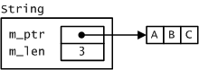

# Beispiel Klasse `String`

## Einführung

In einer objektorientierten Sprache wie C++ gehört eine Klasse `String` für den komfortablen Umgang
mit Zeichenketten zum Pflichtbestandteil der Klassenbibliothek eines jeden C++&ndash;Compilers.
Da in C++ auch standardisierte Klassenbibliotheken existieren, finden wir die
gesuchte Klasse &ndash; unter dem Namen `std::string` &ndash; tatsächlich auch in der STL (&ldquo;Standard Template Library&ldqu&;o;) vor.
Um Übung in der Anwendung der Programmiersprache C++ zu erlangen, beschäftigen wir uns im folgenden mit der Realisierung
unserer eigenen Klasse `String`, siehe dazu die Beschreibung der öffentlichen Schnittstelle dieser String-Klasse in *Tabelle* 1.

---

Und noch ein *Hinweis*:
Der Quellcode im Repository zu dieser Übung ist bewußt sehr elementar gehalten.
Oder um es anders zu formulieren: Viele der syntaktischen Neuerungen von C++ 11/14/17/20
sind bewußt außer Acht gelassen worden.
Es ist dem interessierten Leser überlassen, diese Neuerungen einzuarbeiten.

---

Bei der Implementierung der Klasse `String` ist der Speicherbereich für die einzelnen Zeichen
der Zeichenkette dynamisch zu allokieren. Der Einfachheit halber legen wir zusätzlich zu Grunde,
dass der Umfang dieses Speicherbereichs exakt an die Länge der Zeichenkette angepasst wird,
siehe *Abbildung* 1. Den Overhead im Arbeitsaufwand der einzelnen Methoden nehmen wir in billigend Kauf,
da wir mit dieser Vorschrift eine einfachere Realisierung verbuchen können.

Abbildung 1. Instanzdatenbereich eines `String`-Objekts mit dynamisch allokiertem Datenpuffer.

## Mögliche Spezifikation einer Klasse `String`

Die Klassenelemente in *Tabelle 1* mögen eine Orientierung für Ihre Realisierung der Klasse `String` darstellen:

| Konstruktor    | Schnittstelle und Beschreibung |
|:-------------- |-----------------------------------------|
| Konstruktor | `String();`  Standard-Konstruktor zum Anlegen einer leeren Zeichenkette.|
| Benutzerdefinierter Konstruktor | `String(const char*);`  Benutzerdefinierter Konstruktor. Als Argument wird eine Folge von `char`-Elementen erwartet, die mit `'\0'` abgeschlossen ist, sprich eine klassische &ldquo;C-Zeichenkette&rdquo;. |
| Methode `length` | `int length() const;`  Liefert die Länge der Zeichenkette zurück. |
| Methode `insert` | `bool insert(const String& s, int ofs);`  Fügt die Zeichenkette `s` in die aktuelle Zeichenketten-Instanz an der Position `ofs` ein. |
| Methode `append` | `void append(const String& s);`  Hängt die Zeichenkette `s` am Ende des aktuellen Zeichenkettenobjekts an. |
| Methode `remove` | `bool remove (int ofs, int num);`  Entfernt `num` Zeichen an der Position `ofs` des aktuellen Zeichenkettenobjekts. |
| Methode `subString` | `String subString(int ofs, int num) const;`  Extrahiert eine Teilzeichenkette (beginnend an der Position `ofs` mit `num` Zeichen) aus dem aktuellen Zeichenkettenobjekt. Das Ergebnis wird in Gestalt eines `String`-Objekts zurückgeliefert. |
| Methode `find` | `int find(const String&) const;`  Sucht nach der Zeichenkette `s` im aktuellen Zeichenkettenobjekt. Wird die Zeichenkette gefunden, wird der Index (ihres ersten Vorkommens) innerhalb des aktuellen Zeichenkettenobjekts zurückgeliefert, andernfalls der Wert -1. |
| Methode `toUpper` | `void toUpper();`  Wandelt alle Kleinbuchstaben im aktuellen Zeichenkettenobjekt in Großbuchstaben um. |
| Methode `toLower` | `void toLower();`  Wandelt alle Kleinbuchstaben im aktuellen Zeichenkettenobjekt in Kleinbuchstaben um. |
| Methode `left` | `String left (int num);`  Liefert die ersten `num` Zeichen des aktuellen Zeichenkettenobjekts in Gestalt eines eigenständigen Zeichenkettenobjekts zurück. |
| Methode `right` | `String right (int num);`  Liefert die letzten `num` Zeichen des aktuellen Zeichenkettenobjekts in Gestalt eines eigenständigen Zeichenkettenobjekts zurück. |
| operator `[]` | `char operator[] (int n) const;`  Indexoperator, liefert das *n*.-te Zeichen aus der Zeichenkette zurück. |
| operator `+` | `friend String operator+ (const String& s1, const String& s2);`  Verknüpfung von zwei Zeichenketten in Operatorenschreibweise als Alternative zur `append`-Methode. Der `+`&ndash;Operator liefert als Resultatobjekt die Verkettung der zwei Zeichenketten `s1` und `s2` zurück, d.h. ihre Hintereinanderschreibung. Die Objekte `s1` und `s2` bleiben bei dieser Operation unverändert. |
| operator `+=` | `friend String& operator+= (String& s, const String& s1);`  Verknüpfung von zwei Zeichenketten in Operatorenschreibweise als Alternative zur `append`-Methode. Der `+=`-Operator hängt die Zeichenkette `s1` an `s` an, das Ergebnis der Verkettung kommt folglich in Objekt `s` zum Tragen. |
| operator `==` | `friend bool operator== (const String& s1, const String& s2);`  Der ==-Operator vergleicht zwei Zeichenkettenobjekte auf inhaltliche Gleichheit. |
| operator `!=` | `friend bool operator!= (const String& s1, const String& s2);`  Der !=-Operator vergleicht zwei Zeichenkettenobjekte auf inhaltliche Ungleichheit. |
| Ausgabe | `friend std::ostream & operator<< (std::ostream&, const String&);`   Ausgabe einer Zeichenkette in der Konsole. Die Ausgabe der Zeichenkette `"ABC"` sollte wiederum im Format `"ABC"[3]` erfolgen, die Länge der Zeichenkette ist in eckigen Klammern aufzuführen. |
| Eingabe | `friend std::istream & operator>> (std::istream&, String&);`   Eingabe einer Zeichenkette in der Konsole. Bei der Eingabe darf man in der Implementierung eine maximale Anzahl für die einzulesenden Zeichen voraussetzen. |

*Tabelle* 1. Elemente der Klasse `String`.

*Hinweis*: Klassenelemente wie der Kopierkonstruktor oder der Destruktor fehlen in *Tabelle* 1,
da sie in einer korrekten Realisierung ohnehin vorhanden sein müssen.

Die in der Lösung vorgestellte Implementierung der Klasse `String` verzichtet auf jegliche Unterstützung aus der *C Runtime Library* (*CRT*).
Dies erfolgt zu Lehrzwecken, um die Realisierung einer Klasse ohne jegliche Unterstützung durch eine externe Bibliothek zu betrachten.
In der Praxis würde man zur Realisierung die *CRT* mit einbeziehen, um das Rad für eine Reihe elementarer Operationen wie Zeichenkette kopieren,
vergleichen, usw. nicht zweimal erfinden zu müssen.

Zum Testen Ihrer Implementierung schreiben Sie für jede Methode oder zusammengehörige Gruppe von Klassenelementen
eine separate Testfunktion. Die Regel &ldquo;weniger ist mehr&rdquo; gilt an dieser Stelle nicht, ganz im Gegenteil:
Um Änderungen in Ihrer Implementierung auch im Nachhinein seriös praktizieren zu können,
benötigen Sie einen robusten Testrahmen. Eine sehr ausführliche Anregung dazu finden Sie hier:

---

[Zurück](../../../Readme.md)
